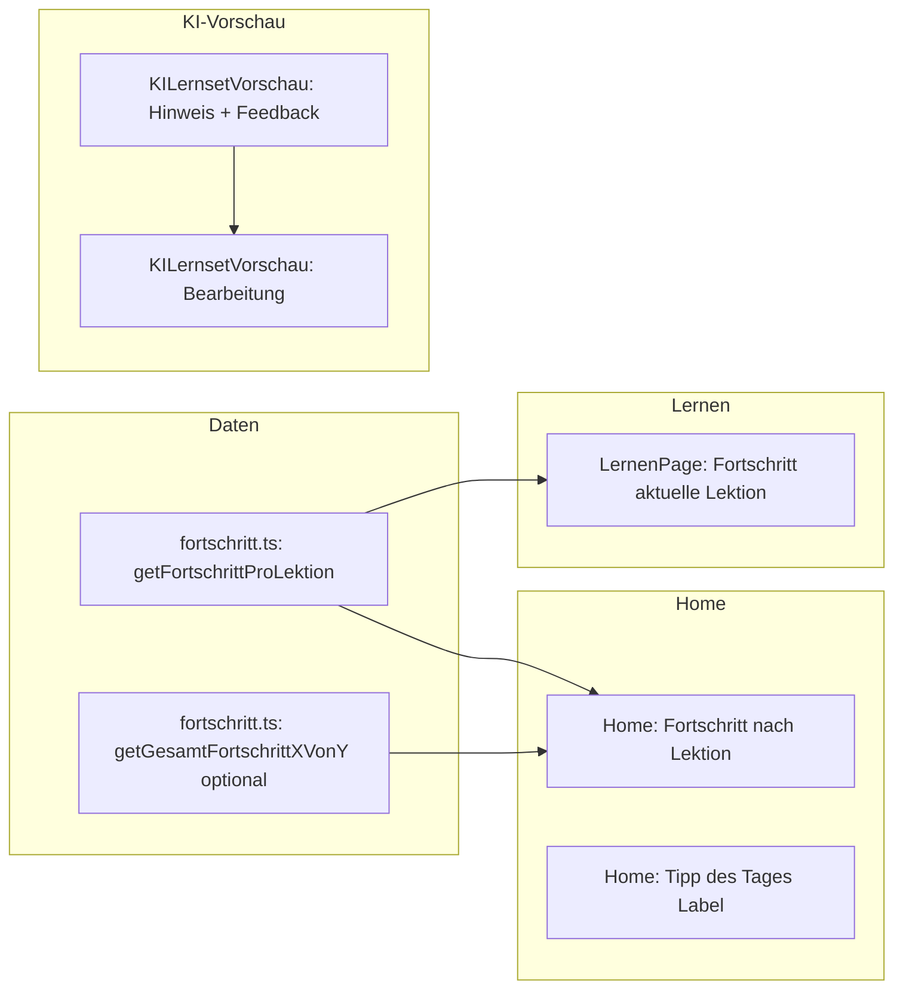

# Umsetzungsplan: Nutzen und Lernqualität

Konkrete Schritte zur Umsetzung der drei Teilziele: **klare Lernziele und Fortschritt**, **Inhaltsqualität bei KI**, **schneller Einstieg**.

---

## 1. Klare Lernziele und Fortschritt

**Ziel:** Nutzer sehen, wo sie stehen (z. B. „Lektion 3 von 5“, „a-Deklination: 80 % sicher“). Bestehende Daten aus `statistik.ts` und `spacedRepetition.ts` sichtbar machen.

### 1.1 Datenlage (bereits vorhanden)

- **[src/data/statistik.ts](src/data/statistik.ts):**  
  `getSessionCountByLesson()` (Anzahl Sessions pro Lektion),  
  `getAveragePercentByLesson()` (Durchschnitts-Prozent pro Lektion),  
  `getBestVsFirstPercentByLesson()` (erste vs. beste Quote).
- **[src/data/fortschritt.ts](src/data/fortschritt.ts):**  
  `getFortschrittÜberblick()` (gesamte Lektionen, Durchschnitt, fällige Vokabeln),  
  `getEmpfohleneLektion()` (fällig / zuletzt / Einstieg).
- **[src/pages/HomePage.tsx](src/pages/HomePage.tsx):**  
  Zeigt bereits „Dein Fortschritt“ (Lektionen absolviert, Durchschnitt, Vokabeln fällig) und „Empfohlen für dich“.

### 1.2 Konkrete Umsetzung

| Schritt | Was | Wo / wie |
|--------|-----|----------|
| **A** | **„Fortschritt pro Lektion“ (Top-Einträge)** | In `fortschritt.ts` neue Funktion `getFortschrittProLektion(limit?: number)` hinzufügen. Liefert aus `getAveragePercentByLesson()` z. B. die ersten 5 Einträge `{ lessonId, lessonName, avgPercent, attemptCount }`, sortiert nach avgPercent absteigend (oder nach letzter Aktivität). |
| **B** | **Home: Block „Deine Lektionen“** | In `HomePage.tsx` unterhalb der bestehenden Karte „Dein Fortschritt“ einen neuen Abschnitt einbauen: z. B. „Fortschritt nach Lektion“ mit 3–5 Zeilen „[Lektionname]: X % sicher“ (avgPercent). Pro Zeile einen Button „Lernen“, der wie bei Favoriten/Zuletzt `saveLernenState` setzt und zu `/lernen` navigiert (Lernset per `lessonId` zuordnen; bei Deklination/Grammatik/Sachkunde/Karteikarten die bestehende Logik aus `handleLernen` bzw. `pageState` nutzen). |
| **C** | **„X von Y Lektionen“ (optional)** | In `fortschritt.ts` Funktion `getGesamtFortschrittXVonY()`: „Y“ = Anzahl aller möglichen Lektionen (Lernsets aus `getLernsets()`, `DEKLINATION_LESSON_OPTIONS`, Grammatik-Themen, Sachkunde-Themen, Verben-Lektionen, Karteikarten-Sets). „X“ = Anzahl davon, die in `getSessionCountByLesson()` mindestens 1 Session haben. Auf Home in „Dein Fortschritt“ anzeigen: „X von Y Lektionen mindestens einmal absolviert“. |
| **D** | **Lernen: Fortschritt für aktuelle Lektion** | In `LernenPage.tsx` auf der Stufe „Modus wählen“ (step `chooseMode`) für die aktuell gewählte Lektion (z. B. `selectedLernsetId`, Deklination, …) die passende `lessonId` ermitteln und aus Statistik `getAttempts(lessonId, 'test')` oder `getAveragePercentByLesson()` den Ø-Wert holen. Eine Zeile anzeigen: „Du hast diese Lektion X Mal absolviert, Ø Y %“ (oder „Y % sicher“). |

**Reihenfolge:** A → B (schnell sichtbarer Nutzen), dann D, dann C.

---

## 2. Inhaltsqualität absichern (KI)

**Ziel:** Hinweis zu KI-Inhalten, Feedback-Möglichkeit, ggf. Korrektur in der Vorschau.

### 2.1 Wo KI-Inhalte vorkommen

- **[src/pages/KILernsetVorschauPage.tsx](src/pages/KILernsetVorschauPage.tsx):** Vorschau-Tabelle vor dem Speichern eines KI-Vokabel-Lernsets.
- Nach dem Speichern werden KI-Lernsets wie andere Lernsets in „Lernen“ genutzt (keine spezielle Kennzeichnung im Lernmodus nötig für den ersten Schritt).

### 2.2 Konkrete Umsetzung

| Schritt | Was | Wo / wie |
|--------|-----|----------|
| **A** | **Hinweis „Von KI erstellt“** | In `KILernsetVorschauPage.tsx` oberhalb der Tabelle einen kurzen Hinweis einbauen: z. B. „Von KI erstellt – bei Fehlern bitte melden oder Karten unten bearbeiten.“ (CSS: dezent, z. B. kleine Infobox.) |
| **B** | **Feedback „Fehler melden“** | Ebenfalls in `KILernsetVorschauPage`: einen Button/Link „Fehler melden“ (z. B. am Ende der Seite oder neben dem Hinweis). Bei Klick: `mailto:` mit vorkonfiguriertem Betreff/Körper, z. B. „Fehler im KI-Lernset: [Name des Sets]“. Optional: pro Tabellenzeile ein kleines Icon „Feedback zu dieser Karte“, gleiches mailto mit Karteninhalt (front/back) im Body. Kein Backend nötig. |
| **C** | **Bearbeitung in der Vorschau** | In der Vorschau-Tabelle jede Zeile bearbeitbar machen: Beim Klick auf „Bearbeiten“ (pro Zeile) oder auf die Zelle: Inline-Inputs für Vorderseite und Rückseite (und falls vorhanden `wrongOptions`). State in `KILernsetVorschauPage` (z. B. `editedItems: Record<number, { front?, back?, wrongOptions? }>`). Beim Speichern (`handleSaveConfirm`) die bearbeiteten Werte in `items` übernehmen und so an `saveLernset` übergeben. Keine Änderung in `lernsets.ts` nötig, nur Nutzung der bereits unterstützten Felder. |

**Reihenfolge:** A → B → C (Hinweis zuerst, dann Feedback, dann Bearbeitung).

---

## 3. Schneller Einstieg

**Ziel:** Klarer „Jetzt lernen“-Pfad (existiert), erkennbarer „Tipp des Tages“ / „Empfohlene Lektion“ mit Begründung.

### 3.1 Bereits vorhanden

- Home: Button „Jetzt lernen“, Sektion „Empfohlen für dich“ mit `empfohleneLektion` (Name, Grund: fällig / zuletzt / Einstieg), Button „Lernen“ ruft `handleLernen` auf.
- `getEmpfohleneLektion()` priorisiert: (1) Sets mit fälligen Vokabeln, (2) zuletzt genutzt, (3) erstes Lernset.

### 3.2 Konkrete Umsetzung

| Schritt | Was | Wo / wie |
|--------|-----|----------|
| **A** | **„Tipp des Tages“ / Label** | In `HomePage.tsx` die Sektion „Empfohlen für dich“ optisch als Tipp hervorheben: z. B. Überschrift „Tipp des Tages“ oder „Als nächstes“ und Untertitel wie bisher („X Vokabeln fällig“, „Zuletzt genutzt“, „Gut zum Einstieg“). Keine Logik-Änderung, nur Text/CSS. |
| **B** | **Empfehlung sichtbar halten** | Sicherstellen, dass „Empfohlen für dich“ nur ausgeblendet wird, wenn `empfohleneLektion === null` (z. B. keine Lernsets). Wenn nur Deklinationen/Karteikarten existieren, `getEmpfohleneLektion` in `fortschritt.ts` ggf. erweitern, damit auch erste Deklination oder erstes Karteikarten-Set als „start“-Empfehlung zurückgegeben werden kann (optional, je nach gewünschtem Scope). |
| **C** | **Fortschritts-Widget** | Siehe Abschnitt 1 (Block „Deine Lektionen“ auf Home + Fortschritt pro Lektion in Lernen). Das ist der „schnelle Einstieg“ durch klare Anzeige, was als nächstes Sinn ergibt. |

**Reihenfolge:** A, dann B falls gewünscht, C ist in Abschnitt 1 abgedeckt.

---

## Abhängigkeiten und Reihenfolge

**Empfohlene Implementierungsreihenfolge:**

1. **Fortschritt (1.A, 1.B)** – `getFortschrittProLektion`, dann Block „Fortschritt nach Lektion“ auf Home.
2. **KI (2.A, 2.B)** – Hinweis + „Fehler melden“ auf KILernsetVorschauPage.
3. **Lernen-Fortschritt (1.D)** – Anzeige „X Mal absolviert, Ø Y %“ auf LernenPage.
4. **KI-Bearbeitung (2.C)** – Bearbeitbare Zeilen in der Vorschau.
5. **Optional:** 1.C (X von Y), 3.A/3.B (Tipp-Label, erweiterte Empfehlung).

---

## Kurz-Zusammenfassung

| Teilziel | Konkret | Dateien |
|----------|---------|---------|
| **Lernziele & Fortschritt** | Neue Funktion `getFortschrittProLektion(limit)`; auf Home Block „Fortschritt nach Lektion“ (Name + „X % sicher“ + Lernen-Button); auf LernenPage bei Modus-Auswahl eine Zeile „X Mal absolviert, Ø Y %“. Optional: „X von Y Lektionen“ aus `getGesamtFortschrittXVonY()`. | `fortschritt.ts`, `HomePage.tsx`, `LernenPage.tsx` |
| **Inhaltsqualität KI** | Hinweis „Von KI erstellt – bei Fehlern melden oder bearbeiten“; Button „Fehler melden“ (mailto); Vorschau-Tabelle pro Zeile bearbeitbar (front/back/wrongOptions), beim Speichern übernehmen. | `KILernsetVorschauPage.tsx` |
| **Schneller Einstieg** | Sektion „Empfohlen“ als „Tipp des Tages“ / „Als nächstes“ labeln; Empfehlungslogik ggf. auf Deklination/Karteikarten erweitern; Fortschritts-Widget wie oben. | `HomePage.tsx`, optional `fortschritt.ts` |

Alle Schritte nutzen nur bestehende Daten (Statistik, Spaced Repetition, Lernsets) und erfordern kein neues Backend.
