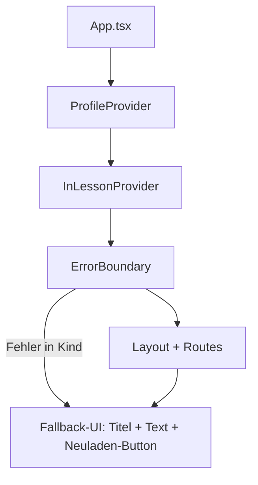
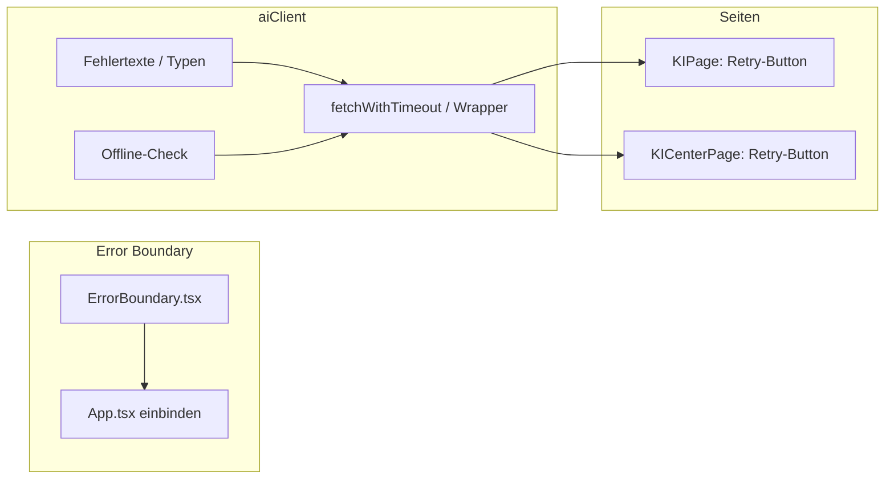

# Umsetzungsplan: Zuverlässigkeit und Fehlertoleranz

Konkrete Schritte für **globalen Error Boundary**, **verständliche KI-/Netzwerk-Fehler mit Retry** und **optionalen Offline-Hinweis** vor KI-Aufrufen.

---

## Übersicht: Wo KI genutzt wird

| Datei | KI-Funktion | Fehlerbehandlung heute |
|-------|-------------|-------------------------|
| [src/pages/KIPage.tsx](src/pages/KIPage.tsx) | `chatLernsetAssistant`, `generateKarteikartenSetWithAI` | `error`-State, Anzeige in `
`, keine Retry-Button |
| [src/pages/KICenterPage.tsx](src/pages/KICenterPage.tsx) | `chatLernSupport` | `helperError`, Anzeige in `
`, kein Retry |
| [src/data/aiClient.ts](src/data/aiClient.ts) | alle `fetch()`-Aufrufe | `throw new Error(...)` bei `!res.ok`, bei Parse-Fehlern, kein Timeout, keine Nutzertexte |

Weitere KI-Funktionen (`generateDeklinationWithAI`, `generateVokabelSetWithAI`) sind in aiClient definiert, werden aktuell nicht von anderen Seiten aufgerufen; bei künftiger Nutzung gelten dieselben Prinzipien.

---

## 1. Globaler Error Boundary

**Ziel:** Unbehandelte React-Fehler (Render/ Lifecycle) abfangen und eine freundliche Seite anzeigen statt weißen Bildschirm; Nutzer kann Seite neu laden.

### 1.1 Wo und wie

| Schritt | Was | Wo / wie |
|--------|-----|----------|
| **A** | **Error-Boundary-Komponente** | Neue Datei [src/components/ErrorBoundary.tsx](src/components/ErrorBoundary.tsx). Klasse-Komponente (weil `getDerivedStateFromError` / `componentDidCatch` nur in Klassen möglich). State: `hasError: boolean`, optional `error: Error`. Im Fehlerfall rendern: Container mit Titel „Etwas ist schiefgelaufen“, kurzer Text (z. B. „Ein unerwarteter Fehler ist aufgetreten.“), Button „Seite neu laden“ (`window.location.reload()` oder `navigate(0)`). Ohne Fehler: `children` rendern. |
| **B** | **Boundary in App einbinden** | In [src/App.tsx](src/App.tsx) die gesamte App (oder mindestens den Baum unterhalb von ProfileProvider/InLessonProvider) in `<ErrorBoundary>` wrappen. Empfehlung: einmal um den Inhalt innerhalb von `ProfileProvider` und `InLessonProvider`, damit Login/Modal weiter laufen können; alternativ um das komplette `ProfileProvider`-Kind. |
| **C** | **Styling** | Eigenes kleines CSS (z. B. in ErrorBoundary.css oder in App.css): zentrierter Block, gut lesbar, Button klar hervorgehoben. Keine Abhängigkeit von Layout/Sidebar nötig – der Boundary ersetzt den gerenderten Baum. |

### 1.2 Ablauf (kurz)

**Reihenfolge:** A (Komponente + CSS) → B (Einbindung in App).

---

## 2. Netzwerk-/KI-Fehler verständlich machen

**Ziel:** Einheitliche, nutzerfreundliche Meldungen bei API-Fehlern/Timeout; „Erneut versuchen“-Button wo sinnvoll.

### 2.1 aiClient: einheitliche Fehlertypen und Texte

| Schritt | Was | Wo / wie |
|--------|-----|----------|
| **A** | **Fehlertypen / -konstanten** | In [src/data/aiClient.ts](src/data/aiClient.ts) (oder neues [src/data/aiErrors.ts](src/data/aiErrors.ts)): Konstanten oder Hilfsfunktion für Nutzer-Texte, z. B. `NETWORK_ERROR_MESSAGE = 'Verbindung fehlgeschlagen. Bitte prüfe deine Internetverbindung und versuche es später erneut.'`, `TIMEOUT_MESSAGE = 'Die Anfrage hat zu lange gedauert. Bitte später erneut versuchen.'`, `SERVER_ERROR_MESSAGE = 'Der Dienst ist vorübergehend nicht erreichbar. Bitte später erneut versuchen.'`. Optional: eigene kleine Fehlerklasse mit `code: 'network' | 'timeout' | 'server' | 'parse'` und `userMessage: string`, die von den fetch-Wrappern geworfen wird. |
| **B** | **fetch mit Timeout + Fehlerzuordnung** | In aiClient eine interne Hilfsfunktion `fetchWithTimeout(url, options, timeoutMs)` (z. B. 60 000 ms): `fetch` + `AbortController` für Timeout. Bei `AbortController.abort()` nach Timeout: `throw new Error(TIMEOUT_MESSAGE)` (oder nutzerorientierte Fehlerklasse). Bei `res.ok === false`: je nach `res.status` (5xx → SERVER_ERROR_MESSAGE, 401/403 → Hinweis auf API-Key, sonst Netzwerk/Server) `throw new Error(userMessage)`. Bei Netzwerkfehlern (fetch wirft, z. B. Failed to fetch): `throw new Error(NETWORK_ERROR_MESSAGE)`. Alle bestehenden `fetch(OPENAI_API_URL, ...)`-Aufrufe in `generateDeklinationWithAI`, `generateVokabelSetWithAI`, `chatLernsetAssistant`, `generateKarteikartenSetWithAI`, `chatLernSupport` durch diese Hilfsfunktion ersetzen (oder einen zentralen „openAIRequest“-Wrapper, der Body/Options entgegennimmt und die gleiche Fehlerbehandlung macht). |
| **C** | **Parse-/Format-Fehler** | Bestehende `throw new Error('Die KI-Antwort konnte nicht…')` etc. beibehalten, aber Text ggf. auf nutzerfreundliche Kurzform umstellen (z. B. „Antwort konnte nicht gelesen werden. Bitte erneut versuchen.“). |

### 2.2 Aufrufende Seiten: einheitliche Anzeige + Retry

| Schritt | Was | Wo / wie |
|--------|-----|----------|
| **D** | **KIPage** | In [src/pages/KIPage.tsx](src/pages/KIPage.tsx): Wenn nach `chatLernsetAssistant` oder `generateKarteikartenSetWithAI` ein Fehler geworfen wird, bleibt `setError(e.message)` (oder `e.userMessage` falls eigene Fehlerklasse). Zusätzlich: unterhalb der Fehlermeldung einen Button **„Erneut versuchen“**. Beim Chat: Retry = erneuter Aufruf von `handleSend` mit gleicher Eingabe (oder letzte Nachricht nochmal senden). Beim „Lernset erstellen“: Retry = erneuter Klick auf „Lernset erstellen“ (gleiche Parameter). Dafür `error`-State beibehalten und Button onClick setzt `setError(null)` und löst den jeweiligen Request erneut aus (z. B. `handleCreateSet()` nochmal aufrufen oder State so setzen, dass Nutzer einmal „Erneut versuchen“ klickt und die bestehende Aktion wieder ausgeführt wird). |
| **E** | **KICenterPage (Lernunterstützer)** | In [src/pages/KICenterPage.tsx](src/pages/KICenterPage.tsx): Bei `helperError` neben oder unter der Fehlermeldung einen Button **„Erneut versuchen“**: setzt `setHelperError(null)` und ruft `handleSendHelper()` erneut auf (mit der zuletzt gesendeten Nachricht, die noch in `helperMessages` steht – dafür die letzte User-Nachricht nochmal an die API schicken). Optional: „Zuletzt gesendete Nachricht erneut senden“-Logik explizit machen (z. B. letzte user-Message in Ref halten und bei Retry nochmal mit gleichem Inhalt aufrufen). |

### 2.3 Ablauf (kurz)

- **aiClient:** Alle API-Calls laufen über einen gemeinsamen Request-Wrapper mit Timeout + einheitlicher Fehlerbehandlung und nutzerorientierten Texten.
- **KIPage / KICenterPage:** Fehler wie bisher anzeigen, zusätzlich Button „Erneut versuchen“, der die letzte Aktion (Send/Create) wieder ausführt.

**Reihenfolge:** A → B (Fehlertexte + fetchWithTimeout/Wrapper in aiClient) → C (Parse-Texte) → D → E (Retry-Buttons auf den Seiten).

---

## 3. Offline-Hinweis (optional)

**Ziel:** Vor dem Aufruf von KI-Funktionen prüfen, ob das Gerät online ist; wenn nicht, klaren Hinweis anzeigen und Frust vermeiden.

### 3.1 Wo und wie

| Schritt | Was | Wo / wie |
|--------|-----|----------|
| **A** | **Offline-Check-Hilfe** | In [src/data/aiClient.ts](src/data/aiClient.ts) (oder [src/utils/network.ts](src/utils/network.ts)) eine exportierte Funktion `isOnline(): boolean` (z. B. `typeof navigator !== 'undefined' && navigator.onLine`). Optional: Konstante `OFFLINE_MESSAGE = 'Für KI-Funktionen wird eine Internetverbindung benötigt. Andere Lerninhalte funktionieren offline.'`. |
| **B** | **Vor KI-Aufruf prüfen** | In den Seiten, die KI aufrufen, **bevor** `chatLernsetAssistant`, `generateKarteikartenSetWithAI` oder `chatLernSupport` aufgerufen wird: wenn `!isOnline()`, dann sofort `setError(OFFLINE_MESSAGE)` (bzw. `setHelperError(OFFLINE_MESSAGE)`) und **keinen** fetch auslösen. So erscheint sofort eine klare Meldung, ohne Timeout. Optional: gleiche Meldung in aiClient am Anfang jeder exportierten KI-Funktion prüfen und dort `throw new Error(OFFLINE_MESSAGE)` – dann müssen die Seiten nur den bestehenden catch nutzen. |
| **C** | **Hinweis-Text in UI** | Die Meldung „Für KI-Funktionen wird eine Internetverbindung benötigt. Andere Lerninhalte funktionieren offline.“ kann 1:1 in der bestehenden Fehler-Box (`.ki-error`) angezeigt werden; kein eigener „Offline-Banner“ nötig. Optional: kleines Icon oder Zusatz „Keine Verbindung“ neben der Meldung. |

**Reihenfolge:** A → B (in aiClient am Anfang jeder KI-Funktion oder in KIPage/KICenterPage vor dem Aufruf) → C nur bei Bedarf (Text reicht).

---

## Abhängigkeiten und Reihenfolge

**Empfohlene Implementierungsreihenfolge:**

1. **Error Boundary** – Komponente erstellen, in App wrappen, CSS.
2. **aiClient** – Fehlertexte/Konstanten, `fetchWithTimeout` (oder zentraler openAI-Request), alle fetch-Aufrufe umstellen; bei Bedarf Offline-Check am Anfang jeder KI-Funktion.
3. **KIPage** – „Erneut versuchen“-Button bei Fehler, ggf. Nutzung der neuen Fehlermeldungen.
4. **KICenterPage** – „Erneut versuchen“ beim Lernunterstützer.
5. **Offline** – `isOnline()` und Prüfung vor KI-Aufruf (in aiClient oder in den Seiten).

---

## Kurz-Zusammenfassung

| Teilziel | Konkret | Dateien |
|----------|---------|---------|
| **Globaler Error Boundary** | Klasse-Komponente mit `componentDidCatch` / `getDerivedStateFromError`; Fallback-UI: „Etwas ist schiefgelaufen“ + „Seite neu laden“. Boundary in App um den Hauptinhalt (Layout + Routes). | `src/components/ErrorBoundary.tsx`, `ErrorBoundary.css`, `src/App.tsx` |
| **Netzwerk/KI-Fehler** | In aiClient: einheitliche Nutzer-Texte (Verbindung fehlgeschlagen, Timeout, Server); fetch mit Timeout (AbortController); alle API-Calls über Wrapper. Auf KIPage und KICenterPage: Fehler wie bisher anzeigen + Button „Erneut versuchen“ (letzte Aktion wieder ausführen). | `src/data/aiClient.ts`, optional `src/data/aiErrors.ts`; `src/pages/KIPage.tsx`, `src/pages/KICenterPage.tsx` |
| **Offline-Hinweis** | `isOnline()` (navigator.onLine); vor jedem KI-Aufruf prüfen, wenn offline sofort Fehlermeldung setzen/werfen: „Für KI-Funktionen wird eine Internetverbindung benötigt. Andere Lerninhalte funktionieren offline.“ | `src/data/aiClient.ts` (oder `src/utils/network.ts`), ggf. KIPage/KICenterPage |

Kein Backend nötig; alle Änderungen nur Frontend (React-Komponente, aiClient, bestehende KI-Seiten).
